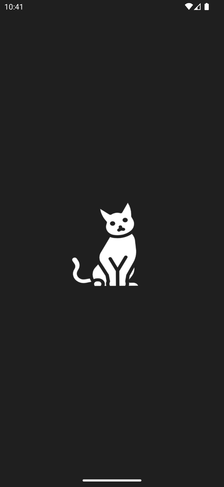
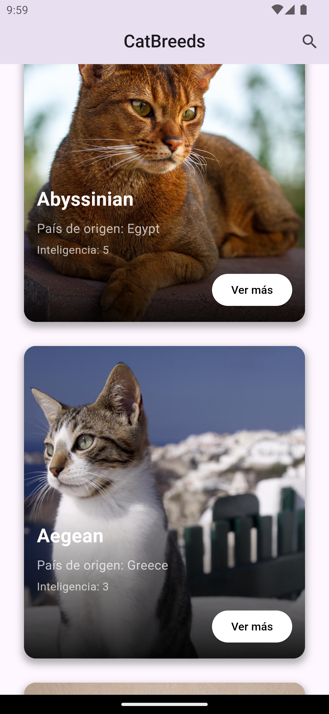
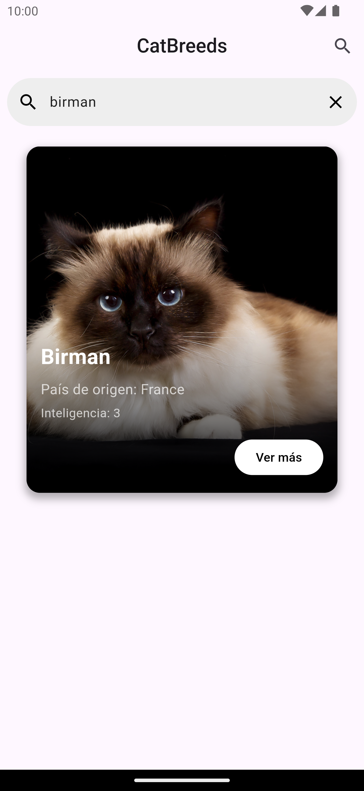
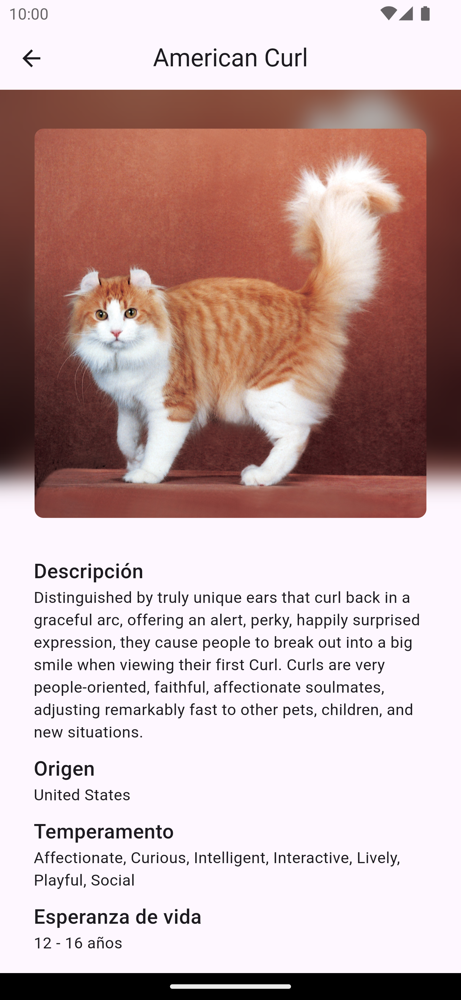

# CATBREEDS APP

[](https://flutter.dev)
[](https://github.com/tuusuario/tu-repo/releases)

## Descripción

Catbreeds App es una aplicación que utiliza la API de `thecatapi` para proporcionar información detallada sobre diversas razas de gatos. Permite a los usuarios explorar una lista completa de razas, conocer sus orígenes y acceder a otros detalles importantes.

## Características

- 🐱 Información detallada sobre razas de gatos.
- 🌍 Consulta la información desde varias fuentes de datos.
- 📊 Visualización de estadísticas y niveles (ej: energía, afecto, inteligencia).
- 🔍 Filtrar y buscar por distintas razas.
- 🌐 Integración con enlaces a recursos externos.

## Capturas de Pantalla

<p float="left">
  
  
  
  
</p>

## Requisitos del Sistema

- Flutter 3.24.3 
- Dart 3.5.3
- Compatible con iOS y Android

## Instalación

Sigue estos pasos para clonar y ejecutar la aplicación en tu máquina local.

1. **Clona el repositorio:**

```bash
git clone https://github.com/ivanbvb13/catbreeds_app.git
cd catbreeds_app
```

## Estructura 


```
├── lib/
│   ├── src/
│   │   ├── domain/
│   │   │   ├── constants/            # Constantes globales del proyecto
│   │   │   ├── helpers/              # Funciones auxiliares y utilidades
│   │   │   ├── models/               # Modelos de datos
│   │   │   ├── services/
│   │   │   │   ├── implementations/  # Implementaciones de servicios
│   │   │   │   ├── interfaces/       # Definición de interfaces para servicios
│   │   ├── ui/
│   │   │   ├── controllers/          # Controladores para gestionar la lógica de la UI
│   │   │   ├── pages/
│   │   │   │   ├── detail/           # Página de detalle
│   │   │   │   ├── landing/          # Página de inicio o bienvenida
│   │   │   ├── shared/               
│   │   │   │   ├── helper/           # Helpers compartidos dentro de la UI
│   │   │   ├── widgets/              # Componentes reutilizables (widgets) dentro de la UI
├── locator.dart                      # Archivo para la configuración de dependencias
├── main.dart                         # Archivo principal que inicia la aplicación

```


## Dependencias

Estas son algunas de las principales dependencias utilizadas en el proyecto:

- **flutter_native_splash**: Permite crear pantallas de carga nativas para la aplicación, mejorando la experiencia de usuario al iniciar.
- **get_it**: Un contenedor de inyección de dependencias para Flutter, que facilita la gestión de instancias y la organización del código.
- **get**: Un paquete que proporciona soluciones de gestión del estado, enrutamiento y más, simplificando el desarrollo de aplicaciones Flutter.
- **http**: Utilizado para el manejo de peticiones HTTP, permitiendo realizar solicitudes a servidores y obtener datos de APIs.
- **cached_network_image**: Permite cargar imágenes desde la red y almacenarlas en caché local, mejorando la eficiencia y experiencia del usuario.

### Instalación de las dependencias

Asegúrate de tener estas dependencias agregadas en tu archivo `pubspec.yaml`:

```yaml
dependencies:
  flutter_native_splash: ^2.4.1
  get_it: ^8.0.0
  get: ^4.6.6
  http: null
  cached_network_image: ^3.4.1
```


## Fuentes

La aplicación utiliza la fuente `Poppins-Regular.ttf` para una mejor apariencia y legibilidad. Asegúrate de incluir esta fuente en tu proyecto y declararla en el archivo `pubspec.yaml`:

```yaml
flutter:
    fonts:
        - family: PoPoppinsRegularppins
            fonts:
                - asset: fonts/Poppins-Regular.ttf
```

